# Fundamentals

It's everything you've been waiting for. Iron ore? Cringe, not real. Real ore minerals, real deposits, and the real road from rock to metal. A Create add-on for NeoForge 1.21.1.

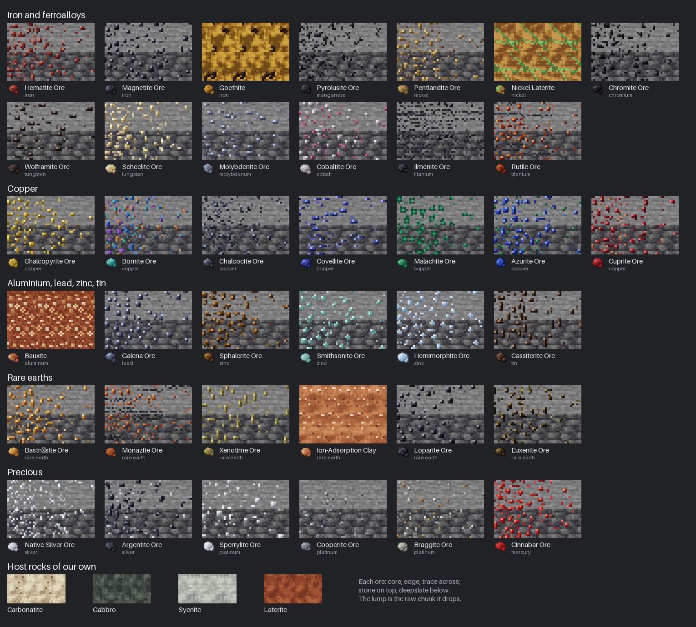

Vanilla gives you "iron ore". The ground doesn't. Iron is in hematite and magnetite, lead is in galena, zinc is in sphalerite, the rare earths are in bastnäsite and monazite and a clay that doesn't even have a mineral name. Fundamentals replaces the generic ores with the minerals that actually carry each metal, puts them in the ground the way geology does, and makes you win the metal out of them the way smiths and smelters did, by hand at first and with Create's machines later.

Requires [Create](https://modrinth.com/mod/create) and [Create: The Factory Must Grow](https://modrinth.com/mod/create-tfmg). [Chemica](https://modrinth.com/mod/chemica) is optional: installed alongside, its acids, gases and plastics and ours are one industry ([docs/chemica.md](docs/chemica.md)). Alpha: the geology is in, and the rare earth chain runs from ore to magnet.

## Deposits, not blobs

Ore generates as the kind of body it really forms: banded iron beds, lead-zinc beds in limestone, silver and cobalt veins in calcite, porphyry copper stocks, bauxite and nickel laterite under tropical soil, carbonatite plugs for the rare earths with monazite in their weathered tops, a rare monazite vein in quartz, a dark layered intrusion at the bottom of the world for chromite and the platinum metals. Each body is rich at its core and peters out at the edges, and the grade of an ore block decides what it drops.

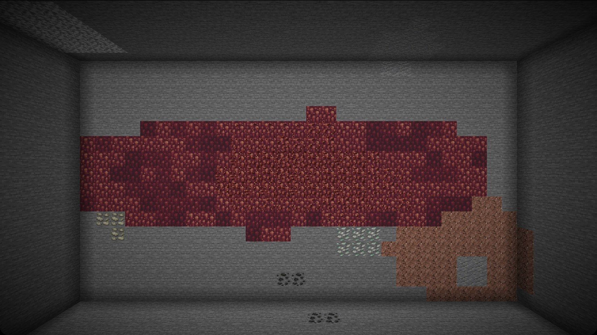
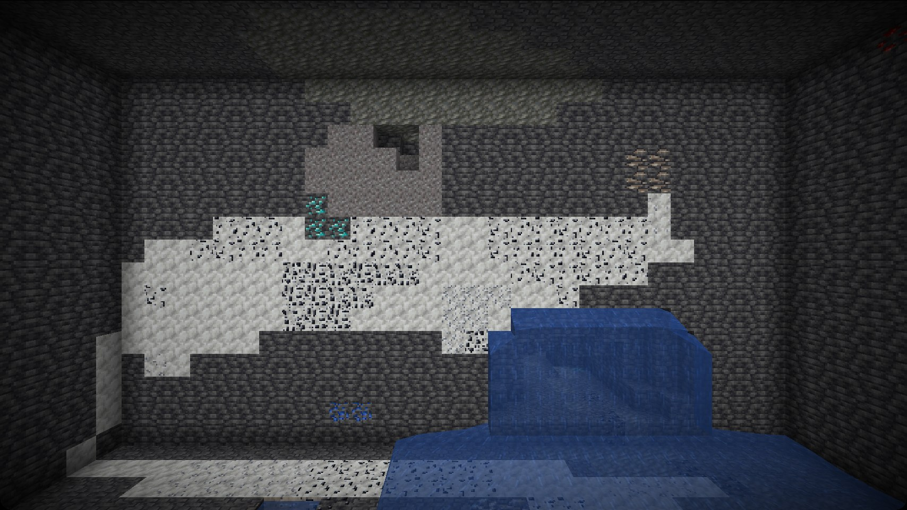
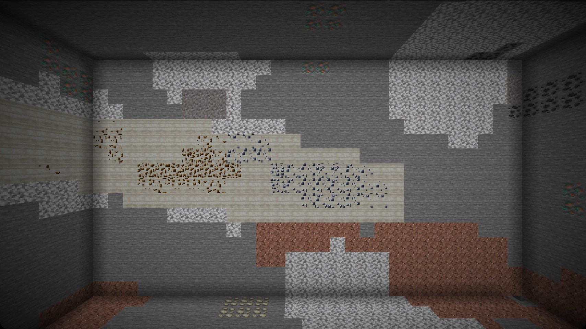

An ore takes on whatever rock it formed in. The same hematite sits in stone, deepslate, granite, tuff, calcite, Create's crimsite, limestone, asurine and ochrum, or our own carbonatite and gabbro, and looks like it belongs there.

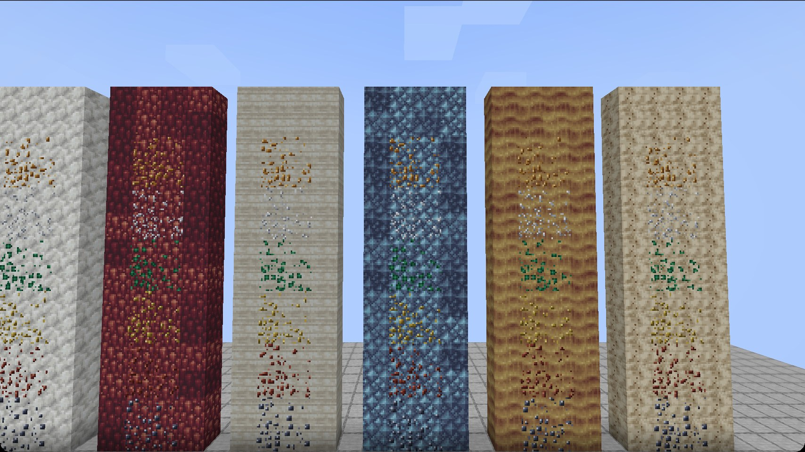

## The minerals

Forty-seven of them, each dropping a raw chunk of itself:

- **Iron and ferroalloys:** Hematite, Magnetite, Goethite, Pyrolusite, Pentlandite, Nickel Laterite, Chromite, Wolframite, Scheelite, Molybdenite, Cobaltite, Ilmenite, Rutile
- **Copper:** Chalcopyrite, Bornite, Chalcocite, Covellite, Malachite, Azurite, Cuprite
- **Aluminium, lead, zinc, tin:** Bauxite, Galena, Sphalerite, Smithsonite, Hemimorphite, Cassiterite
- **Lithium:** Spodumene
- **Zirconium and beryllium:** Zircon, Beryl, Bertrandite
- **Rare earths:** Bastnäsite, Monazite, Xenotime, Ion-Adsorption Clay, Loparite, Euxenite, Thortveitite (scandium)
- **Precious:** Native Silver, Acanthite, Sperrylite, Cooperite, Braggite, Cinnabar
- **Fluxes and salts:** Fluorite, Borax, Trona, Halite

Vanilla gold and copper ore stay: they are native gold and native copper, which are real minerals. Vanilla iron ore is gone, including the big deep veins, which are magnetite now.

The advancements screen has a Periodic Table tab, all 118 elements in their places: each lights up the first time you hold anything made of it, raw chromite giving you iron, chromium and oxygen at once.

## From rock to metal

Iron is made the way it was made for three thousand years before the blast furnace. Build a bloomery out of clay, load it with iron ore and charcoal (and only charcoal; the sulfur in coal ruins iron), light it with a torch, and wait. What comes out is not an ingot but a bloom, a spongy lump of iron and slag, which you hammer into wrought iron; the slag is The Factory Must Grow's own, which its concrete and asphalt take. Copper comes straight out of the bloomery from malachite, azurite and cuprite. Galena has to be roasted on a fire first, then gives lead bullion, lead still holding its silver, which a furnace remelts to lead.

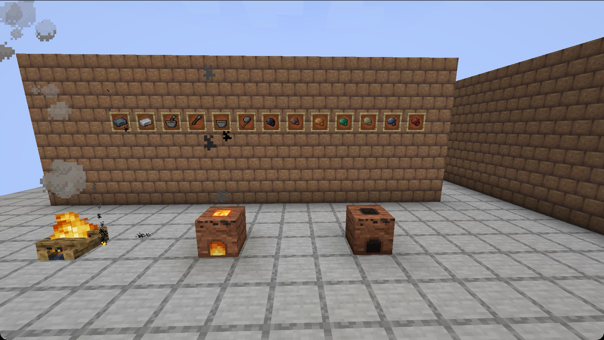
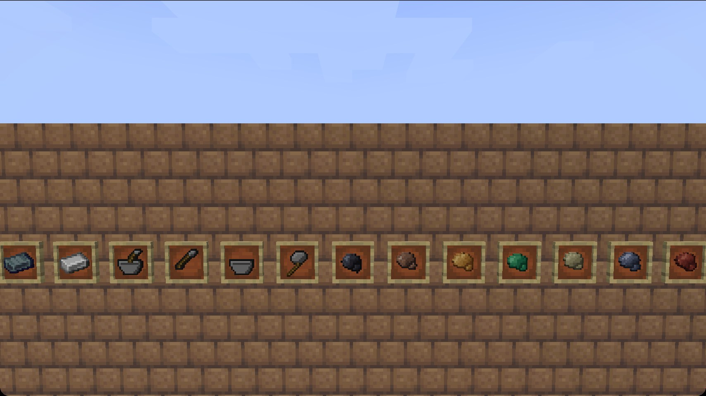

A mortar and pestle grinds by hand what Create's millstone grinds by power: grain to flour, and coloured minerals to the pigments painters have ground since antiquity. Hold the mortar in one hand and the material in the other.

No furnace or water fan reduces iron ore. Create's crushing wheels grind it to crushed iron ore, which only The Factory Must Grow's blast furnace takes. Our minerals are kept out of the common ore tags Create crushes and smelts straight to metal, so every sulfide is roasted first; Create's stones give up ore, not metal (crimsite hematite, asurine smithsonite, tuff only flint, washed gravel a little magnetite black sand); and chests keep one iron ingot, tool or armour piece in four, iron golems drop nuggets, and a drowned's copper ingot has gone green to malachite. Structure chests carry a smidge of the pack's metals instead, rarer the harder the place: tin, lead, zinc, nickel and bronze in villages, mineshafts, dungeons, shipwrecks and ruined portals; silver, cobalt, tungsten, molybdenum and the odd platinum nugget in strongholds, temples, bastions, fortresses, trial chambers, mansions, outposts and buried treasure; rare earth oxides and metals and the platinum group only in end cities and ancient cities. YUNG's Better structures count as the vanilla ones they replace.

The rest, aluminium and the rare earths, waits for Create machinery and the multiblock plant that comes after it. That is the plan, not a gap: the ore is the reason to build the machines.

What that plant will make from the rare earths already exists as items: the ground minerals, the light and heavy mixed concentrates, each of the sixteen elements as oxide, powder and ingot, and the magnet alloys NdFeB and SmCo. The oxides are the colours they really are, and each metal leans toward the colour its salts are known by.

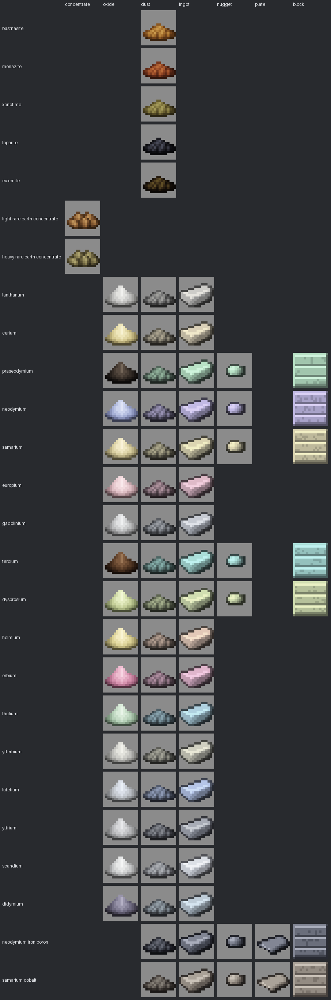

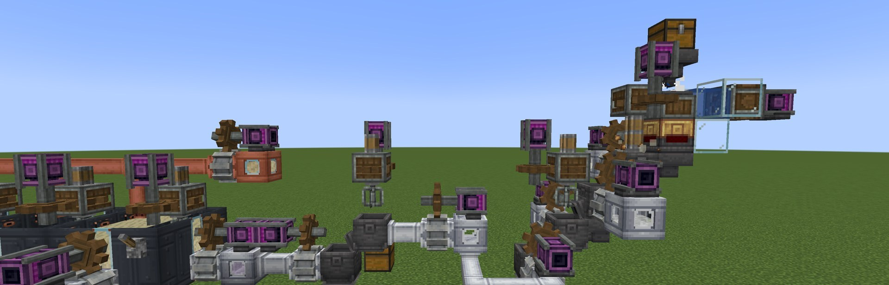

The first step toward them works on Create's own machines. A millstone or crushing wheels grind bastnäsite, xenotime, loparite and euxenite. Monazite needs no grinding, whether panned from beach sand or dug from the weathered top of a carbonatite (as at Mount Weld) or from a quartz vein in old upland granite (as at Steenkampskraal, and nearly as rare). A wash under an encased fan then does what a miner's shaking table does: the light grains wash away and about half of what you feed it stays behind as mixed concentrate, light from monazite and loparite, heavy from xenotime and euxenite. Bastnäsite is floated instead, as it is in every carbonatite mill: its dust beaten with water and naphthenic acid, the fatty-acid collector, in a basin under a mixer, and the rare earth carbonate comes off the top as bastnäsite concentrate. The clay is leached, not milled at all, with salt and water: sodium chloride was the first lixiviant, in heaps; ammonium sulfate replaced it and is now pumped into the hillside in place, which costs the groundwater, the streams and the slopes dearly. Hydrochloric acid barely touches a phosphate, so monazite, xenotime and the other mixed concentrates are cracked first, roasted in sulfuric acid in a heated basin to a rare earth sulfate, which frees their phosphate as phosphoric acid. It is the hot roast of Baotou, 500 to 800 °C, at which the thorium turns to an insoluble pyrophosphate (a 200 to 300 °C bake would dissolve it with the rare earths), so when the sulfate leaches in cold water the thorium stays behind. A sulfate does not turn to a chloride in hydrochloric acid, so soda ash drops the rare earths from the leach as their carbonate, and the carbonate dissolves in hydrochloric acid. Bastnäsite concentrate is roasted on a fire instead, which takes its cerium to Ce(IV): hot hydrochloric acid leaches the rest and leaves a cerium concentrate, as Mountain Pass sold it, that calcines to ceria (Gupta and Krishnamurthy, Extractive Metallurgy of Rare Earths; Habashi).

The rare earths are parted the way the industry parts them, by solvent extraction in **mixer-settler batteries**. Casings facing the same way merge as you place them, the way Create's tanks do, into any vat from three by three up to three across, three along and two tall, their tanks and batches growing with the volume: nine casings are a lab vat, eighteen a plant vat. The back row is the mixing box, stirred by one of Create's Mechanical Mixers standing over it, the rows ahead the settling bay, with a weir between that only the churn tops and a window in each outside wall to watch the phases part. The casing is plastic sheet or stainless steel plate, so a plant need not wait on a polymer works. The vats are open: you can fall in, and neither liquid is good for you. Stages of one size standing end to end are one battery, fed and drained by Create's pipes, and a cut needs the same number of stages at any size, so a line of small vats proves a cut before the plant is built.

What comes out of the dissolver is crude: iron, aluminium, thorium and fines still in it, and each ore leaves its own residue behind (monazite its thorium, xenotime and euxenite some uranium and thorium; bastnäsite its ceria; the leached clay is just clay). Lime drops the impurities out as a sludge and clarifies the liquor; feed a battery crude liquor instead and it runs three cuts and then fouls, crud at the interface and the organic turned brown, until you drain it and scrub it with lime. Charge every stage with an organic extractant (P507, P204 or naphthenic acid, cut with kerosene and saponified with lime as it is made up, which is what sets the pH the cuts work at) and it floats on top and is all but never used up: two per cent of a batch leaves entrained in the raffinate each cut. Keep the mixers under 128 rpm, or the phases emulsify and the battery stops. Pump the chloride liquor in at the back of the first stage and hydrochloric acid in at the front of the last: the raffinate comes out of the sides of the first stage, the loaded strip out of the last. How many stages a cut needs depends on how alike the pair is: samarium leaves neodymium in eight stages, but neodymium from praseodymium takes a battery thirty-two stages long. A battery too short for its cut just stalls, and Create's goggles tell you why. A cut does not halve its liquor: each batch comes out light and heavy in the proportions the ore carries them, so the mixed liquor gives nine parts light to one heavy, lanthanum-cerium a third lanthanum, didymium a fifth praseodymium, and the clay's heavy liquor is two-thirds yttrium, with europium and terbium a trickle. Thirteen cuts take the mixed liquor down to single elements, and europium leaves gadolinium the way plants really part it, not by a cut: zinc reduces it alone to Eu2+, and sulfuric acid drops it as europium sulfate, which nitric acid takes back to europium liquor (McCoy's method). Each single element precipitates with oxalic acid and calcines to the oxide at 800 to 1,000 °C, in a blast furnace or under Create's fan over lava, since a plain furnace never gets that hot. The oxide is the stable form, and the metal comes out of it three ways, all on The Factory Must Grow's chemical vats: the lights (lanthanum to neodymium, and didymium) go through their fluoride, made with hydrofluoric acid from fluorspar, and are electrolysed from the molten salt on electrodes; the heavies (gadolinium, terbium, dysprosium and yttrium) are reduced from the fluoride by calcium metal under argon, which gives the fluorspar back as slag; and samarium, which boils, is reduced straight from the oxide by lanthanum metal under argon and distils off, leaving lanthanum oxide to go round again. Europium and the heavies past dysprosium are sold as oxide, as they really are, and never become metal. A kindled blaze burner is 1,000 °C and one fed a blaze cake 1,600. The fluoride is the electrolysis bath, not its feed, and comes back nine times in ten while the oxide is used up. Electrolysis runs in the fluoride melt at 1,000 to 1,100 °C and the two metallothermic reductions near 1,500, past where the fluorspar slag melts, so all three want the cake. Argon is spun out of air in a centrifuge vat, and calcium is electrolysed from the plant's own calcium chloride, molten.

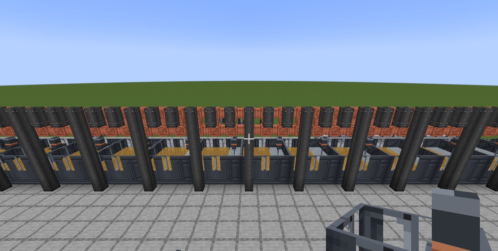

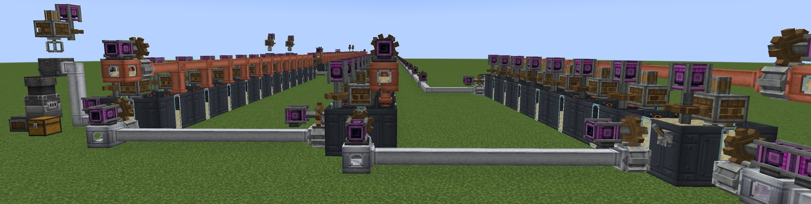

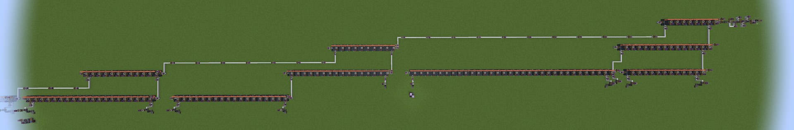

Goggles on any casing tell you what the battery is waiting for, how far the organic and the liquor have got down the line, and what the ends and the product tanks hold; hold W over a casing for the Ponder scene of a working stage.

Late in the chain there is a second route for a few cuts: **magnetic separation**, which is real but so far only a laboratory result (PNNL, 2026; KU Leuven). The rare earth ions are chemical near-twins but magnetically far apart, from lanthanum, lutetium and yttrium with no moment at all to dysprosium and holmium at 10.6 Bohr magnetons, and a permanent magnet's field gradient pulls the paramagnetic ones through the liquor. A magnetomigration cell is a plastic channel with an NdFeB magnet in its right wall, crafted from plastic sheet and a plastic tank, or stainless steel plate, and a magnet; cells end to end are a line, one pass each, fed at the back of the first and drained from the two sides of the last, the magnet side giving what the magnets drew. No organic, no acid, no sump and no power. Only the cuts whose products sort cleanly by moment have the route, each in far fewer passes than its battery has stages: yttrium from the late heavies in 2 cells (14 stages), samarium from europium-gadolinium in 3 (16), ytterbium from lutetium in 4 (20) and lanthanum from cerium, whose 2.5 is weak, in 7 (12). The products and their proportion are the battery's, so the routes are interchangeable; didymium, terbium-dysprosium, holmium-erbium and the broad cuts stay solvent extraction's. Cold helps: the ions' susceptibility follows Curie's law, one over the absolute temperature, so the head cell reads the liquor's temperature and a batch takes as much longer as the cut's magnetic contrast falls, about 7 per cent quicker at 0 °C than at 20 and a fifth slower at 80. Samarium and europium barely care, their susceptibility being mostly Van Vleck's, temperature-independent, and the goggles give the temperature, the contrast and the time a batch takes.

Scandium never enters the liquors. Its own mineral, thortveitite, is a rare greenish-black prism in the pegmatites that carry xenotime and euxenite; ground and chlorinated with coke (a heated basin, two dust, a coke, 500 mB each of chlorine and water) it gives scandium liquor, which takes the heavies' road: oxalate, scandia, fluoride, and calcium under argon to the metal. Al-Sc is two per cent scandium: a scandium nugget in eight aluminium, or the fluoride straight into four blocks of molten aluminium, as the master alloy is made.

### What they are for

Nothing in the chain is for its own sake. Neodymium (or praseodymium, or didymium, as the industry uses it) with iron and ferroboron (boric acid, freed from desert borax with sulfuric acid, smelted with iron and charcoal), melted superheated under argon, makes NdFeB, the strongest magnet, and gadolinium can stand in for some of the neodymium at a cost; dysprosium or terbium in the melt, 8 per cent of it as in the EH grades, makes Dy-NdFeB, which keeps its field hot; samarium with cobalt and a little iron, copper and zirconium makes SmCo, the Sm2(Co,Fe,Cu,Zr)17 of the high-temperature grades, hotter still. Polarized, each is its own magnet, and The Factory Must Grow's motors, generators, stators and electric pumps are built from them (see Magnets and heat, below), so a rare earth plant is what a motor needs. Lanthanum metal reduces samarium, and lanthanum oxide is the catalyst of fluid catalytic cracking, which turns heavy oil to gasoline and propylene in a heated vat and loses one catalyst in twenty. Cerium with iron is ferrocerium: a flint and steel that never wears out. Europium's red on a yttria host, Y2O3:Eu (YOX), and terbium's green with cerium in lanthanum phosphate, LaPO4:Ce,Tb (LAP), its phosphate from the phosphoric acid the crackers give off, are the phosphor its lamps take, with a flask of mercury to every two, the vapour whose arc lights the phosphor (the rest of that acid goes with ammonia to fertiliser); yttria lines its fireproof vat. Didymium glass is the welder's lens Create's goggles are made of, erbium turns glass pink, and scandium in aluminium is the airframe alloy that makes a panel rack go twice as far.

### Waste

A separation plant makes waste. Every cut leaves a fifth of a batch of spent chloride liquor in a sump under the head stage; when the sump is full the battery stops, and the goggles say so. Pump it out from below: limesand neutralises it to calcium chloride liquor, and that boiled down leaves the calcium chloride that calcium metal is electrolysed from, giving off chlorine, so the plant's waste closes its own loop. Monazite carries thorium, and when the hot-roasted sulfate leaches the thorium stays behind as a mildly radioactive residue that packs into blocks to bury, or dissolves in nitric acid to the thorium nitrate a Welsbach gas mantle is soaked in, thoria with a hundredth part of ceria, the rare earth industry's first product; The Factory Must Grow's gas lamp burns one. The clarifier's sludge, the iron, aluminium and thorium hydroxides the lime throws down, packs into blocks of tailings.

### Acids

The acids exist outside pipes. Hydrochloric, hydrofluoric, nitric and phosphoric acid can be bucketed and poured, burn whatever stands in them (hydrofluoric also poisons), and eat what they really eat: pour one against such a block and it cracks as if being mined, fizzes for five seconds and is gone, and the acid that ate it is spent. Hydrochloric acid takes carbonates, calcite, limestone, dripstone and bone; hydrofluoric takes glass, sand, quartz and tuff; nitric takes copper and iron. Stone shrugs them all off. Concentrated hydrochloric, hydrofluoric and nitric acid (and bromine) fume: within two blocks of any in the open, as a block or in a basin, you take a hit a second unless you wear Create's diving helmet on a filled backtank, the gas mask. And acid eats copper: a Create pipe carrying any acid corrodes and bursts within a couple of minutes, spilling it, and the chloride liquors, spent liquor, calcium chloride liquor and bittern eat it too in about eight, and seawater in about an hour (copper takes the sea well enough that cupronickel is its standard pipe); pumps and valves corrode the same way, but concentrated nitric acid passivates aluminium, its shipping metal, and leaves the Factory's aluminium pipes alone; run the plant in The Factory Must Grow's plastic pipes, pumps and valves (a glass pipe is a copper pipe with a window, and corrodes as one), or in titanium. Plastic's weakness is heat: a plastic pipe, pump, valve or tank in use whose wall is past 110 °C, from a burner, fire or lava beside it or lava in it, sags and bursts within seconds, a tank within a minute. Titanium Pipe, Mechanical Pump, Fluid Valve and Fluid Tank, Create's own built of titanium plate, stay strong hot and shrug off everything the plant carries but hydrofluoric acid, which eats them in half a minute or so, chlorine gas, dry chlorine burning titanium, and hydrochloric acid past 60 °C. Copper and metal tanks corrode ten times slower, a block of wall and its share of the contents at a time; store acid and liquor in the Plastic Fluid Tank, Create's tank in plastic sheet, as real plants keep hydrochloric acid in fibreglass and polyethylene, but not bromine, which attacks polyethylene and eats plastic as acid eats copper.

### Making the acids and the extractants

Every acid is made the way it was first made in bulk, and all start from The Factory Must Grow's sulfuric acid. Salt in hot sulfuric acid gives hydrochloric acid (the salt-cake process), fluorspar gives hydrofluoric, saltpetre heated in it gives nitric acid, which boils off as from Glauber's retort, and bone, standing in for phosphate rock, gives phosphoric acid cold. Nitric acid oxidises sugar to oxalic acid, Scheele's route. Chlorine is Scheele's too, hydrochloric acid on pyrolusite, and it comes off the anode of the molten-chloride electrolyses of calcium and lithium. But that is the old way: nearly all chlorine and all caustic soda come from the chlor-alkali cell, brine (two salt in 1,000 mB of water) electrolysed in a chemical vat on two electrodes over a dimensionally stable anode, De Nora's titanium coated with ruthenium and iridium oxides, baked from a titanium plate, a ruthenium and an iridium nugget in hydrochloric acid. 1,000 mB of brine gives 500 mB each of chlorine, caustic soda and hydrogen, and the anode lasts. Caustic soda is also soda ash boiled with lime, as it was before the cell. It leaves copper and steel alone and eats aluminium, so the Factory's aluminium pipes, pumps, valves and tanks corrode under it.

P204 (D2EHPA) and P507 (EHEHPA) are both 2-ethylhexyl esters on one phosphorus, and are made from propylene and phosphate as the industry makes them. Steam over white-hot coke gives water gas, carbon monoxide and hydrogen; shifted with more steam it gives hydrogen and carbon dioxide, which is also the hydrogen cobalt, molybdenum and tungsten are reduced under. Propylene from cracked naphtha, water gas and hydrogen on a cobalt catalyst give 2-ethylhexanol (the oxo process, the aldol condensation and the hydrogenation in one vat). Bone, coke and sand on electrodes at a superheated burner give white phosphorus, as the electric furnace does, and chlorine over it gives phosphorus trichloride. The alcohol on the trichloride with air and water, cold, is D2EHPA; without the air and heated, the phosphite rearranges to the phosphonate and it is EHEHPA. Both give their chlorine back as hydrochloric acid. Neat, each is a quarter of the organic: cut with kerosene and saponified with lime, it is the P204 or P507 a battery is charged with. Naphthenic acid is washed out of heavy oil with caustic soda and freed with sulfuric acid, in a vat.

### Salt and seawater

The sea is salt and the rivers are not. Water drawn from a source in an ocean or off a beach, by bucket, Create's hose pulley or a pump at an open pipe end (Create's or The Factory Must Grow's), comes up as seawater; from a river, a lake, a swamp or a cave it is fresh water as ever. Poured out it is water again, but its salt tells: it eats copper pipe slowly, about an hour to a pipe, will not raise steam in a boiler (Create's boiler takes only fresh water, as real ones take it demineralised) and waters no crops. Salt is made from the sea, not from any water: seawater boiled down in a heated basin leaves salt and bittern, the bitter mother liquor left once the halite crystallises, and gives its steam back as fresh water, 900 mB of every 1,000, since a salt works' evaporator and a desalination plant are one machine. Bittern boils down in turn to the magnesium chloride the titanium plant runs on, and it holds the sea's bromide: with chlorine in a heated vat it gives bromine, 20 mB from 1,000 mB of bittern (a hundred times the sea's real 65 mg a litre, but scarce), a fuming, poisonous red-brown liquid that eats copper, iron, aluminium and polyethylene, and its magnesium chloride as before. A whiff of bromine in a quartz envelope makes a halogen lamp, twice the light bulbs from a tungsten filament, and argon, the filling of every bulb since Langmuir, half again. Seawater leaches ion-adsorption clay too, twice as much of it as the salt-and-water lixiviant. Or dig salt: halite, rock salt, lies in seams in the desert evaporite beds with the borax and trona, and a millstone or crushing wheels grind it to salt.

### The other metals

Cobaltite from the silver-cobalt veins roasts on a fire to the oxide, which hydrogen reduces to cobalt in a heated vat; four of it with two samarium, an iron, four copper and two zirconium nuggets make seven SmCo, one with six nickel, a chromium and a tungsten ingot and five aluminium and two rhenium nuggets, melted under argon, makes seven of a CMSX-4-like nickel superalloy (its aluminium the gamma-prime Ni3Al and the alumina scale that make it a superalloy, the tungsten standing in for tantalum) that The Factory Must Grow's turbine blades are now cast from, over an MCrAlY bond coat (nickel, cobalt, chromium, aluminium and a yttrium nugget atomised under argon) and a yttria-stabilised zirconia barrier, and one goes into its lithium charge as the cathode. Most real cobalt comes from the Congo's copper ores, once smelted there in electric furnaces to a cobalt-copper-iron white alloy, and out of nickel refineries, and here the nickel refinery gives it too: P507 takes it out of the nickel sulfate liquor and hydrochloric acid strips it to a rose cobalt chloride liquor, which electrowins to cobalt and chlorine. Chalcopyrite from a porphyry stock roasts, and bornite, chalcocite and covellite roast to a calcine; the bloomery smelts either to copper matte, the converter (two matte and a sand, superheated) blows it to blister copper, and the blast furnace fire-refines that to copper. Sphalerite roasts to zinc oxide and smithsonite and hemimorphite calcine to it; zinc boils below the heat that reduces it, so it was distilled from a sealed retort with charcoal, and a zinc oxide and a charcoal over a superheated burner give an ingot. Zinc oxide is also the activator the Factory's rubber cure takes, and half of all zinc goes on steel: four heavy plates and a zinc nugget, heated, hot-dip to four galvanized steel plates, which serve wherever a steel plate does and never rust, where a bare heavy plate rusts as steel does. Carbon reduces iron along with nickel, so roasted pentlandite or nickel laterite smelted with charcoal gives ferronickel, never nickel, as the electric furnaces of New Caledonia and Indonesia make it; three ferronickel, three ferrochrome and four steel make ten stainless, where two thirds of real nickel goes. Molybdenite roasted in a heated basin gives molybdenum trioxide and, one roast in ten, the rhenium flue dust all mined rhenium comes from (about a quarter of real supply is now recycled); ammonia takes the dust to ammonium perrhenate, and hydrogen in a heated vat reduces the trioxide to molybdenum and the perrhenate to rhenium nuggets, about one to every ten molybdenite, a few times the richest real ore. A trioxide in six blocks of steel, about one per cent molybdenum as in the chromium-molybdenum pressure-vessel steels, makes 54 of the steel whose plate the heavy machinery casing now takes, and a halogen lamp seals its quartz round molybdenum foil. Nine tenths of manganese goes into steel: two pyrolusite, a coke, an iron nugget and a flux, superheated, smelt to ferromanganese, and one ferromanganese in six steel makes seven of Hadfield's manganese steel, which hardens where it is struck, so an ingot of it presses to two heavy plates. Wolframite will not open to acid: caustic soda under pressure, or soda ash fused, takes it to sodium tungstate liquor, while scheelite opens to hot hydrochloric acid as tungstic acid; ammonia takes either to ammonium paratungstate, which a blast furnace calcines to the trioxide, hydrogen reduces it, and the metal draws to the filament every light bulb burns, carburises to the carbide every mechanical drill bites with, and goes into the superalloy. Chromite from the layered intrusion grinds and washes to a concentrate; its iron reduces along with the chromium, so smelted with coal coke and a limesand flux over a superheated burner, as a submerged-arc furnace smelts it, it gives ferrochrome, and three ferrochrome with a nickel and six steel (or three ferronickel and four steel) make ten stainless steel, which the Factory's flarestack is now built on and its steel chemical vat lined with. Chromium metal goes the long way: trona, the soda mineral lying with the borax in the desert evaporites, calcines to soda ash; chromite roasted with soda ash in a heated basin gives yellow sodium chromate, sulfuric acid turns it to orange dichromate, carbon reduces that to the green oxide and gives the soda ash back, and the oxide with milled aluminium powder, lit by a superheated burner, burns on by itself to chromium metal, the thermite reaction. The superalloy takes the metal, and the oxide is chrome oxide green dye. Cassiterite, from the tin veins and from beach and river sand, is heavy enough that a wash under a fan leaves it as concentrate; roasted of the sulfur and arsenic of the sulfides riding with it, it smelts with charcoal in the bloomery (or with coke over a superheated burner) to crude tin, and a heated basin with a stick liquates the tin off its iron-tin hardhead and poles out the dross. Arsenical copper came first, but tin bronze is about an eighth tin: seven copper and a tin make eight bronze, the metal Create's peculiar bell is now cast in, that five ingots of make a bell, and that Create's mechanical bearing now turns in; a tin and a lead make the solder every loop of the Factory's circuit board assembly now takes.

Titanium takes the Kroll road. Rutile panned from the sands is titanium dioxide already; ilmenite, iron titanate, is smelted with coal coke over a superheated burner, as the electric furnaces of Sorel and Richards Bay smelt it, to a black titania slag and a cast iron ingot. Either, with coke and chlorine in a heated basin, gives titanium tetrachloride, a colourless fuming liquid. Molten magnesium reduces it under argon in a heated vat to titanium sponge and magnesium chloride, which electrolyses back to magnesium and chlorine, so both go round; the first magnesium comes from the sea, by the Dow process from seawater, lime and hydrochloric acid, or boiled down from the bittern salt-making leaves. Titanium melts past a blaze cake, so the sponge is arc-melted under argon on two electrodes to the ingot. Most titanium is never metal: the tetrachloride burnt in air gives the whitest pigment there is and its chlorine back, four white dye to the oxide, and titanium plate in place of steel makes the Factory's turbine engine go twice as far. Two plate and an ingot make four titanium pipe, the chemical plant's hot, corrosion-proof line.

Zircon is the third mineral of the heavy sands, honey-brown grains panned with the ilmenite and rutile (and a few in the syenite), washed under a fan to a concentrate. As sand it faces a mould, so the Factory's casting basin takes one, and it whitens tile glaze: one in eight terracotta makes eight white. For the metal it takes titanium's road: chlorinated with coke to a crude zirconium tetrachloride, which hydrolysed in water is zirconia and gives hydrochloric acid back. Zircon carries a fiftieth as much hafnium, its chemical twin; four crude chloride distilled through a molten salt give four clean and, one time in ten, a hafnium tetrachloride. Magnesium under argon reduces either to sponge and the sponge is arc-melted. Twelve zirconia and a yttria (7.7 per cent, the 7YSZ of a thermal barrier) make yttria-stabilised zirconia, the thermal-barrier coat the Factory's turbine blade now takes; zirconium plates line four steel chemical vats where stainless lines two, and a hafnium nugget in the superalloy melt makes six ingots where it made four.

Nickel metal comes off the matte: by the sulfate leach and electrowinning under the platinum metals, or by Mond's carbonyl process. Converter matte roasted dead gives nickel oxide; water gas in a heated vat reduces it and carries the nickel off as nickel carbonyl, and a second heated vat decomposes that to nickel pellets, which a heated press makes ingots of, the residue now and then a platinum group concentrate. Nickel carbonyl is the deadliest thing in the mod (NIOSH's immediately dangerous level is 2 parts per million). It never corrodes a pipe, but out of an open pipe end, a broken pipe, tank or vat, or a basin it hits everyone within three blocks hard every second, with nausea and weakness, and half a minute later withers them in proportion to what they breathed, as the real thing fills the lungs a day later. The nickel smelter's dusts, matte, roasted pentlandite and nickel oxide, cause cancer and are breathed like beryllium's, and a sulfide roasting on a lit campfire, smoker or furnace gives off sulfur dioxide. Create's diving helmet on a filled backtank keeps all of it out.

Beryllium comes from beryl, pale green prisms in the pegmatites, and bertrandite, a white mineral in the fluorite-bearing tuff beds of the dry country, as at Spor Mountain. Beryl is melted and quenched in water to a frit (an emerald will do, at half the yield), which hot sulfuric acid opens to beryllium sulfate liquor; bertrandite leaches as it is. Ammonia drops the hydroxide, hydrofluoric acid and ammonia take it to ammonium fluoroberyllate, a blast furnace to the fluoride, and magnesium under argon, superheated, to beryllium pebbles and a slag; the pebbles melt to ingots. A nugget in five copper, or the oxide with coke under four copper blocks, is beryllium copper, springy and sparkless: the Factory's cable connector built on it makes three. The hydroxide, the oxide and the salts are a dust that scars the lungs, breathed by everyone near when held or stirred in a basin; Create's diving helmet on a filled backtank keeps it out.

### The platinum metals

The platinum metals ride in nickel-copper sulfide and are never won alone. Raw pentlandite smelts in the bloomery to nickel matte, which collects them; two matte and a sand, superheated, convert to converter matte (a copper matte can go in with a nickel one), and a hot sulfuric acid leach takes the nickel, copper and cobalt into a green liquor that electrowins back to nickel and copper (the cobalt extracted first, if wanted), leaving the platinum group concentrate behind, one time in ten. The layered intrusion's sperrylite, cooperite and braggite, put into that leach with the matte, give a concentrate every time.

The refinery is the classical one, batch by batch in basins and vats. Aqua regia (hydrochloric and nitric acid, three to one), or hydrochloric acid with chlorine, takes platinum and palladium and leaves the other four. Ammonium chloride, made from Haber ammonia and hydrochloric acid, drops platinum as the yellow chloroplatinate; ammonia then acid drop palladium as yellow dichlorodiammine palladium. The insolubles chlorinated in a lime slurry give off osmium and ruthenium as their volatile tetroxides; hydrochloric acid catches the ruthenium. What is left, chlorinated with salt, dissolves; ammonium chloride drops iridium as the near-black chloroiridate, and rhodium comes last, rose. The platinum salt ignites to sponge and the rest are reduced under hydrogen; none but palladium melts at 1,600 °C, so each sponge is pressed and sintered to an ingot. Aqua regia exists in the world too: it fumes, and eats gold.

They are spent as catalysts and in small hard parts: platinum-rhenium on alumina reforms naphtha to gasoline and hydrogen; a platinum-rhodium gauze burns Haber ammonia to nitric acid (Ostwald); platinum, palladium and rhodium on ceria, the three-way converter where most rhodium goes, make the Factory's exhaust go twice as far; ruthenium lets the superalloy melt make six ingots instead of four; an iridium-tipped spark plug lasts as long as four, a platinum one three; and osmium, the first metal lamp filament, burns in a light bulb as well as tungsten.

### Silver

Most silver has always come out of lead, and here it does too. Galena's lead bullion carries it; stir a zinc ingot into four bullion in a heated basin, the Parkes process, and the silver goes into the zinc, which rises as a crust and leaves three lead behind. The crust is cupelled: blown with air over bone meal, the bone-ash hearth, the lead burns to litharge and the zinc to zinc oxide for the retort, and four silver nuggets stay. Bullion can be cupelled straight, as the ancients did, at the cost of all its lead going to litharge, which charcoal reduces back, or which pastes the plates of the Factory's lead-acid accumulator. Acanthite and native silver from the calcite veins are soaked into a lead ingot on the cupel and give an ingot each. Silver goes where it really went: the contacts of The Factory Must Grow's electrical switch and large switch, the finish on a circuit board, a silver-zinc accumulator, and the front contacts of a solar cell.

### Plastics

The Factory Must Grow's olefins now polymerise the real way, over a Ziegler-Natta catalyst: titanium tetrachloride reduced by aluminium powder under argon gives four violet catalyst, and the Factory's heated plastic vats take one with each 500 mB of ethylene or propylene, giving it back nine times in ten, and still pour molten plastic for its casting machine. PVC, the chemical plant's pipe, comes from ethylene and chlorine: vinyl chloride (with as much hydrochloric acid off the cracking), polymerised in water to a resin, pressed hot to a grey PVC sheet that serves anywhere a plastic sheet does in a pipe, the tank, the cells and the mixer-settler casing. Natural plastic is milky: the plastic tank, the magnetomigration cells and the Factory's plastic pipes, pumps, valves and smart pipes draw translucent and let a little light through (the Factory's plastic block only takes the milkier colour, since it is a full block that hides its neighbours' faces). Dyed plastic is opaque: eight plastic blocks and a dye make eight in that colour, and a dye on a plastic tank colours the whole tank, on a plastic pipe that pipe, to colour-code lines as plants do (ASME A13.1: orange for corrosive, yellow for flammable, green for water, blue for air). A dyed pipe breaks back to a plain one, and so does a dyed tank.

### The book

With Patchouli installed, a book and a raw hematite craft *Fundamentals: First Principles*: every deposit and where to find it, the hand-working, the whole rare earth chain with the stage count of every cut and the road to every metal, the uses, the waste and the acids. It is generated from the same data the game runs on, so its numbers are the game's.

## Metal in air

Metal doesn't keep, and a chest doesn't save it. Copper, brass and bronze take a patina, and copper blocks held as items weather the way placed ones do; silver blackens; iron and steel rust, but only where there is water about, and an ingot rusts through to a rusty one that sand paper takes back to seven nuggets; lanthanum and cerium crumble to their oxide in days of damp air, praseodymium and neodymium in weeks, the heavies slowly. Aluminium, titanium, chromium, stainless steel, nickel, tin, zinc and lead put on a skin of oxide and stop, and gold and the platinum metals never change. Nothing ticks a chest: its contents are aged by the time since it was last opened (or drawn from by a hopper or pipe, a minute or more since), at a rate set by the metal, its form (a nugget faster than an ingot, a block slower) and the air (dry in a desert, damp by water or in a jungle, worst by the sea). Bronze, silver and the rare earth metal blocks weather in place as copper does, honeycomb waxing the first two, the rare earths crumbling to oxide. The inert storage drum keeps a chest's worth under argon piped into it, or kerosene, and a canister filled with argon at a spout seals one stack away.

## Temperature

Minecraft has no thermometer, so the mod carries one. Every block has a temperature in °C, read on demand and never simulated: the biome's climate mapped to degrees (tundra −5, taiga 1, plains 15, jungle 26, desert 30), cooled by altitude the way vanilla decides where snow lies, swinging five degrees either way through the day and dropping in rain and thunder, under open sky only; plus every heat source within reach, at its real temperature (lava 1,150 °C, fire and campfires 800, a lit furnace 750, a blast furnace 1,500, a bloomery 1,200, Create's blaze burner 1,000 kindled and 1,600 seething), and ice and snow the other way, summed with falloff. That is the heat inside; a source's walls hold most of it in, so a step from a lit furnace on the plains reads about 60 °C, not 750. `/heat` says what it is where you stand, and goggles on a stage show it there. Acid eats faster the warmer it is, twice as fast for every ten degrees, within limits. The field itself lives in Fundamentals: Principles, bundled inside this mod's jar, so the Wildspell mods read the same temperature: other mods add sources with a data file (`fundamentalmagic:heat_source`), read it with `Heat.at`, and push on it with `Heat.boost` (`com.wildspell.fundamental.api.heat`).

Five dial thermometers read it, gauges built like Create's speedometer, what does the sensing standing over an andesite casing. Mount one on a block's face and it reads that block, so it goes on a furnace's wall, a vat or a burner; the needle swings across the scale, goggles give the number, and a comparator reads 0 to 15 across it. Mercury in glass reads −39 to 357 °C, where mercury freezes and boils, and past the top the column boils and bursts its glass, leaving a little mercury and a breath of its vapour; the mercury is roasted out of cinnabar in air in a heated basin and condensed. A spirit thermometer, the classic red line, is kerosene dyed red in glass (a glass pane, a bucket of kerosene and red dye), what replaced mercury in homes and schools: it reads only −60 to 150 °C, and past the top it bursts with a small pop and leaves nothing behind, no mercury and no vapour. A bimetallic strip, brass on steel, reads −50 to 500 °C; a type K thermocouple, chromel (a tenth chromium) against alumel (2 aluminium, 2 manganese, 1 silicon; here aluminium nuggets for all three), both nickel alloys melted superheated, −200 to 1,260; and a type S, platinum with a tenth of rhodium against platinum, −50 to 1,600, for blast furnaces and superheated vats. Past the top they peg. The thermocouples wear their IEC colours, K green and S orange.

### Liquid properties

Every fluid the mod makes or carries, the reagents and The Factory Must Grow's oils, fuels, gases and melts, and vanilla's water and lava, has its real density, viscosity, freezing and boiling point, flash point and autoignition temperature, from the CRC Handbook, Perry's, the NIST WebBook and suppliers' data sheets, in one data map (`fundamentals:liquid_properties`) other mods can add to. Goggles on a pipe, pump, valve, tank or basin give the figures and the hazards. Water-based fluids freeze in the pipe: below the freezing point a pipe holds still and a pump moves nothing until it warms, water at 0 °C, seawater at −1.9, brines, liquors and acids far lower. A fluid past its boiling point in an open basin, with no mixer or press over it, boils off a little every two seconds, and whatever it carries is breathed, acid fumes, poison or nickel carbonyl; in a pipe or tank the goggles warn instead. Fresh Bayer liquor leaves the digester at 145 °C, and the Factory's hot blast and melts at their own heat, which softens plastic pipe. A flammable fluid let out of a burst pipe catches fire past its flash point beside a flame, lava or a burner, or anywhere past its autoignition temperature (nickel carbonyl's is 60 °C), and spilt oils and fuels burn as wood does. Thick fluids pump slower, after the Hydraulic Institute's viscosity correction: heavy oil at about half, a polymer melt or fresh concrete at a quarter.

### Magnets and heat

A permanent magnet holds its field only so hot. There are four: NdFeB, Dy-NdFeB, SmCo and alnico, the cast magnet before the rare earths (iron with aluminium, nickel, cobalt and a little copper, superheated to ten ingots). Each alloy's ingot or plate polarizes into its own magnet; The Factory Must Grow's magnet is no longer made. Its motors, generators, large-generator stators, electric pumps and voltmeters are built round one grade, the magnet going in first, and carry it on the item and the placed block, which reads the temperature where it stands every five seconds. Past the grade's rating its output sags and comes back as it cools; past a second point part of the field is lost for good, and the block drops with what is left; at the Curie point it is gone and the machine stops. A pump pushes less as a motor turns slower, and a voltmeter, whose needle swings against its magnet, reads low by what its field has lost. A machine and a magnet in a crafting grid rebuild it at that grade. Goggles give the grade, the temperature and the share of output. The in-game numbers: NdFeB rated 80 °C, lasting loss past 120, Curie 320; Dy-NdFeB 180, 230, 340; SmCo 300, 400, 800, at 80% of NdFeB's strength; alnico 525, 600, 860, at 40%. Real sintered NdFeB runs to about 80 °C (Curie 310–400), the dysprosium grades (SH, UH, EH) to 150–230, SmCo to 250–350 (Curie 720–825) and alnico to 450–550 (Curie about 860), but alnico stores about 5 MGOe against NdFeB's 35–52 and SmCo's 16–32: so aircraft fly SmCo, alnico lives on in sensors, and every other motor is NdFeB with dysprosium for the heat. Machines built before grades, and any Factory magnet still in a chest, count as Dy-NdFeB, which every NdFeB the mod made then was.

## Power

A solar panel goes on a rack. Build the rack from steel and set it down facing the way you want, then mount a photovoltaic panel on it: a P and an N semiconductor from The Factory Must Grow under glass, in an aluminium frame, with a silver nugget for the front contacts. The silicon is doped as a fab dopes it, n-type with phosphorus (four silicon and a white phosphorus) and p-type with boron (four silicon and a boric acid), not the Factory's sulfur and aluminium. Under open sky it feeds TFMG's electrical network, 120 volts while the sun is up and up to 200 watts at noon, nothing at night or in shade. Break it and you get the rack and the panel back.
Where The Factory Must Grow has its own ore for a metal, ours takes its place and ends in the same ingot. Lead comes from galena, nickel from pentlandite's matte (laterite gives only ferronickel), and lithium from spodumene: calcine the spodumene white in a blast furnace to the beta form, roast it with sulfuric acid and leach it to lithium sulfate liquor, throw down lithium carbonate with soda ash, turn that to lithium chloride with hydrochloric acid, and electrolyse the dry chloride molten in a heated electrode vat, which gives off chlorine (lithium can't be won from water). Aluminium takes the real road, not TFMG's straight electrolysis of bauxite: bauxite powder digested in hot caustic soda (Bayer) gives sodium aluminate liquor and red mud, the residue that holds the bauxite's iron, titania and a little scandium; the cooled liquor throws down aluminium hydroxide and gives most of its caustic back, and a blast furnace calcines the hydroxide to alumina. Alumina dissolved in cryolite (made from aluminium hydroxide, hydrofluoric acid and caustic) is electrolysed between graphite electrodes, burning a coke anode, to TFMG's own aluminium ingot (Hall-Héroult), and a pot with cryolite in it fumes hydrogen fluoride like the acid. A spark plug's insulator is alumina, round a nickel electrode; an iridium or platinum tip makes the plug last. Silicon still comes from Nether quartz.

## Status

Alpha. Expect ore amounts and recipes to change. Not yet in any pack. Issues and ideas welcome.

## Building

JDK 21 is provisioned by Gradle. `./gradlew buildAll` builds every target; jars land in `versions/<target>/build/libs/`. `tools/gametest.sh` runs the gametests headless and prints only the failures ("No tests found" after the run means all passed). Textures, models, recipes, tags, names and the book are generated by the scripts in `tools/`, not edited by hand; `tools/regen.sh` reruns them all in order. `tools/showcase/build_showcase.py` writes `tools/showcase/datapack` from the cut recipes: the whole separation tree, fourteen batteries from the mixed liquor down to every single element, each with its mixers, lever, organic and acid feeds and sump, piped into one another, with an oxalate-to-oxide station on every element. `tools/showcase/fresh.sh` builds a flat world, stages that in it and opens the dev client; `tools/showcase/reopen.sh` reopens that world once the client has quit. Never run either while someone is playing: they close the client. The working plan lives in `docs/PLAN.md`; what's agreed but not built yet is in `TODO.md`.

MIT licensed.
